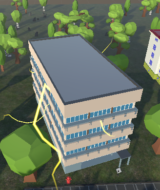
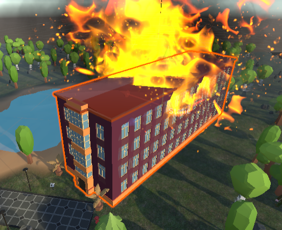
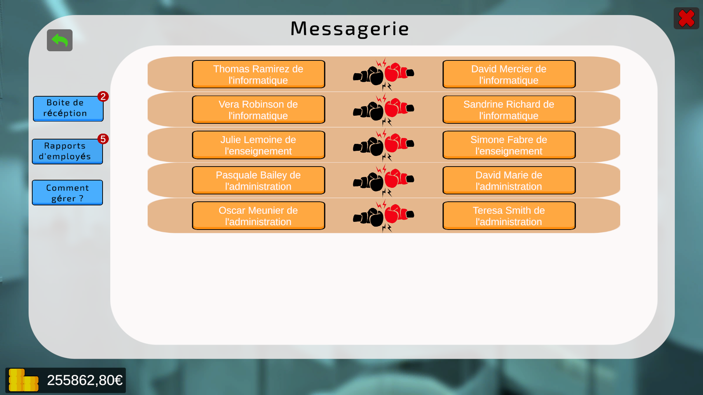

# DEE24-T3-C

# Campus Of Legends

## Qu'est-ce que "Campus Of Legends" ?

**Campus Of Legends** est un jeu de simulation de RH dans un campus totalement délabré et en plein chaos. Votre mission ? Redresser, en tant que vice-président des ressources humaines, le campus universitaire de l'**UNISTRA** et en faire le nouveau **Harvard** !

Tout au long de la partie, vous devrez faire de bons choix. Pour cela, vous devrez forger une équipe digne de l'élite (*ou pas*), qui dirigera le campus universitaire tout au long du jeu. Bien évidemment, cette équipe jouera un rôle crucial dans la gestion de votre budget alloué chaque semestre. De plus, tout comme dans la vraie vie, des événements aléatoires surviendront en fonction de certains facteurs (facteur aléatoire, fidélité des employés) tels que des incendies, des bagarres entre employés, le piratage du système d'information d'un bâtiment et bien d'autres...

    

        
    

    

        
    

    

        
    

Chaque donnée (salaire, budget alloué, etc.) est basée sur des données réelles, publiques, afin de plonger le joueur dans une immersion totale. Des astuces, sous forme de tips, sont présentes afin de guider le joueur tout au long d'une partie, s'il le souhaite ou non. Il est également tenu d'appliquer sa propre stratégie afin de redresser ou non le campus universitaire.

## Qui sommes-nous ?

Nous sommes 4 étudiants passionnés par l'informatique de l'université de Strasbourg (**Unistra**) au sein de l'**IUT Robert Schuman**. Ce jeu a pour but de valider notre semestre et nos compétences acquises tout au long de la création de ce projet en autodidacte sur Unity.

## Instructions d'installation

Bien que notre projet ait été produit à l'aide d'**Unity**, les instructions d'installation sont simples.

Cliquez sur "Lien de téléchargement" : 
<a href="https://seafile.unistra.fr/d/1c3ebc8b5bbc42d29f3a/">Lien de téléchargement</a>

(Si cela ne fonctionne pas : <link>https://seafile.unistra.fr/d/1c3ebc8b5bbc42d29f3a/</link>)

### WINDOWS

Une fois l'installateur téléchargé, ouvrez-le et suivez les instructions de celui-ci. S'il ne fonctionne pas correctement, vous pouvez contacter le support à cette adresse mail : 

git-reply+dee24-t3-c-dee24-t3-c-42281-issue-@unistra.fr.
 (Au-delà de 48 heures sans nouvelles de votre part, nous considérerons ce problème comme réglé)

 ### LINUX

 Rendez-vous sur le lien de téléchargement. Téléchargez le dossier "Linux" puis ouvrez le fichier nommé "CampusOfLegendLinuxVersion.x86_64". 
 
 Le tour est joué !

S'il ne fonctionne pas correctement, vous pouvez contacter le support à cette adresse mail : 

git-reply+dee24-t3-c-dee24-t3-c-42281-issue-@unistra.fr.
 (Au-delà de 48 heures sans nouvelles de votre part, nous considérerons ce problème comme réglé)

 ### MAC OS

  Rendez-vous sur le lien de téléchargement. Téléchargez le dossier "MAC" puis ouvrez le fichier nommé "GAME.app". 

   Le tour est joué !

   S'il ne fonctionne pas correctement, vous pouvez contacter le support à cette adresse mail : 

git-reply+dee24-t3-c-dee24-t3-c-42281-issue-@unistra.fr.
 (Au-delà de 48 heures sans nouvelles de votre part, nous considérerons ce problème comme réglé)
